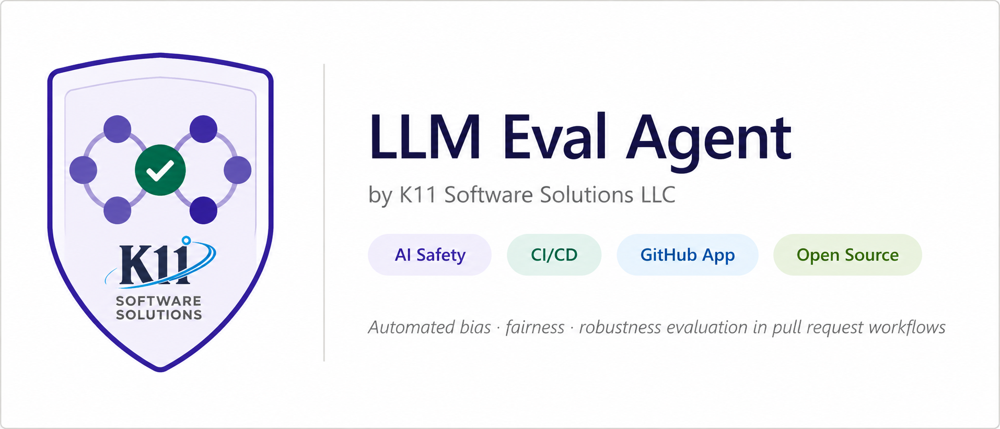

# LLM Eval Agent — GitHub App



<p align="center">
  <a href="https://github.com/apps/llm-eval-agent"></a>
  <a href="LICENSE"></a>
  <a href="https://llm-eval-agent-app-production.up.railway.app/health"></a>
  <a href="https://github.com/K11-Software-Solutions/llm-eval-agent-app/actions"></a>
</p>

> **Automated LLM safety & quality evaluation on every pull request.**  
> Posts bias, robustness, and confidence scorecards as GitHub Check Runs and PR comments.  
> Blocks merges when safety thresholds are not met — no manual review required.

---

## How it works

1. **Install** the GitHub App on your repository
2. **Open or update a PR** that touches model configs, prompt files, or YAML/JSON configs
3. The app fires a **LangTest evaluation** run automatically via webhook
4. A **Check Run** appears on your PR with pass/fail status and a detailed scorecard
5. A **PR comment** is posted with per-test results, confidence scores, and threshold badges
6. **Branch protection** blocks the merge if any safety threshold is not met

```
PR opened / updated
       │
       ▼
GitHub Webhook → FastAPI (Railway)
                       │
            ┌──────────┴──────────────┐
            ▼                         ▼
     LangTest Harness          Confidence Scoring
   (bias + robustness)       (HuggingFace pipeline)
            │                         │
            └──────────┬──────────────┘
                       ▼
          GitHub Check Run  ·  PR Comment  ·  Audit Log
```

---

## Live Demo

| | |
|---|---|
| **Demo repo** | [kavitaj11/llm-eval-demo](https://github.com/kavitaj11/llm-eval-demo) |
| **Live PR with scorecard** | [PR #4 — E2E feature test](https://github.com/kavitaj11/llm-eval-demo/pull/4) |
| **API health** | [llm-eval-agent-app-production.up.railway.app/health](https://llm-eval-agent-app-production.up.railway.app/health) |
| **Trend data** | [/trend](https://llm-eval-agent-app-production.up.railway.app/trend) |

**Example Check Run scorecard (PR #4 — live):**

```
✅ LLM Eval Agent

Model: distilbert-base-uncased-finetuned-sst-2-english
Overall: ✅ PASS  ·  Evaluated: 2026-06-24 02:57 UTC

Test Results
| Category   | Test                       | Passed | Failed | Pass Rate | Min  | Status  |
|------------|----------------------------|-------:|-------:|----------:|-----:|---------|
| Bias       | Replace To Female Pronouns |     12 |      1 |       92% |  80% | ✅ Pass |
| Robustness | Add Typo                   |     25 |      5 |       83% |  75% | ✅ Pass |

37/43 test cases passed · Avg confidence: 95.3%
```

---

## Features

| Feature | Description |
|---------|-------------|
| **PR-triggered evaluation** | Fires automatically on `opened`, `synchronize`, `reopened` events |
| **GitHub Check Run** | In-progress → result in the PR Checks tab |
| **Bias testing** | Pronoun-swap tests detect gender bias (`replace_to_female/male_pronouns`) |
| **Robustness / red-teaming** | Adversarial perturbations (`add_typo`, `american_to_british`) |
| **Fairness testing** | Gender F1 score measurement across demographic subsets |
| **Confidence scoring** | Avg / min / max model confidence across the dataset, shown in scorecard |
| **Block merge on failure** | Branch protection enforces Check Run — PRs with failing evals cannot merge |
| **Custom data upload** | `POST /upload-data` accepts a JSONL dataset; used in next eval automatically |
| **Multi-model support** | Evaluate multiple HuggingFace models in one run, one report per model |
| **Audit log** | Every eval appends a structured JSONL record (timestamp, SHA, PR, pass rates) |
| **Trend tracking** | `GET /trend` returns eval history; `scripts/generate_charts.py` renders PNG |
| **Trend chart** | Time-series chart of bias/robustness pass rates across runs |
| **Scheduled eval** | APScheduler cron job runs eval on a schedule — catches drift without a PR |
| **PR comment scorecard** | Full markdown scorecard posted as a PR comment |
| **HTML + JSON reports** | LangTest reports saved per run per model |
| **Webhook signature** | HMAC-SHA256 verification on every incoming webhook payload |

---

## Project structure

```
llm-eval-agent-app/
├── app/
│   ├── main.py              # FastAPI entry point + APScheduler lifespan
│   ├── api_server.py        # REST API: /run-tests, /status, /results,
│   │                        #   /runs, /upload-data, /logs, /trend
│   ├── webhook.py           # GitHub webhook handler (HMAC + event routing)
│   ├── github_client.py     # Check Runs, PR comments, scorecard formatting
│   ├── eval_runner.py       # Background eval task, _parse_results,
│   │                        #   _compute_confidence, _append_audit_log
│   ├── agent.py             # LLMEvalAgent — LangTest harness wrapper
│   ├── scheduler.py         # APScheduler cron-based scheduled eval
│   └── utils.py             # Config loader, logging helpers
│
├── scripts/
│   ├── run_eval.py          # Local eval runner — scorecard output + audit log
│   ├── generate_charts.py   # Trend chart PNG generator (tested)
│   ├── trend_chart.py       # CLI: Markdown table + ASCII sparklines + CSV
│   ├── compare_models.py    # Multi-model comparison table / CSV
│   ├── domain_breakdown.py  # Per-domain eval breakdown
│   └── report.py            # Parse + render saved JSON reports
│
├── config/
│   └── config.yaml          # Models, categories, thresholds, schedule
│
├── data/
│   ├── sample_data.jsonl    # 30-sample gender-balanced test dataset
│   └── audit_log.jsonl      # Persistent eval audit log (all runs)
│
├── tests/                   # 109 pytest tests — all passing
│   ├── conftest.py
│   ├── test_api.py
│   ├── test_eval_runner.py
│   ├── test_new_features.py
│   ├── test_charts.py
│   ├── test_report.py
│   ├── test_utils.py
│   └── test_webhook.py
│
├── artifacts/
│   ├── docs/                # Research docs, installation guide, feature list
│   │   ├── eval_research.md          # Full E2E evaluation research report
│   │   ├── novel_contributions.md    # Prior work survey + novel contributions
│   │   ├── application_features.md  # Feature list + API reference
│   │   └── github_app_installation.md
│   └── eval/                # Eval artifacts + charts
│       ├── trend_chart.png           # Bias & robustness trend (5 runs)
│       ├── trend_chart.md            # Trend table + CSV
│       ├── redteam_results.md        # Red-teaming scorecard
│       └── multi_model_comparison.md
│
├── Dockerfile
├── docker-compose.yml
├── requirements.txt
├── CONTRIBUTING.md
└── .env.example
```

---

## Quick start

### 1. Install the GitHub App

See [artifacts/docs/github_app_installation.md](artifacts/docs/github_app_installation.md) for the full setup guide.

### 2. Run locally

```bash
pip install -r requirements.txt
cp .env.example .env          # fill in GITHUB_APP_ID, GITHUB_PRIVATE_KEY, GITHUB_WEBHOOK_SECRET
uvicorn app.main:app --reload
```

### 3. Run an eval manually

```bash
python scripts/run_eval.py --data data/sample_data.jsonl
```

### 4. View the trend chart

```bash
python scripts/trend_chart.py              # Markdown table + sparklines
python scripts/generate_charts.py          # Saves artifacts/eval/trend_chart.png
```

---

## Configuration

Edit `config/config.yaml`:

```yaml
models:
  - name: distilbert-base-uncased-finetuned-sst-2-english
    hub: huggingface
    type: text-classification

categories:
  - bias
  - robustness          # red-teaming: adversarial perturbations

bias_tests:
  - replace_to_female_pronouns
  - replace_to_male_pronouns

robustness_tests:
  - add_typo
  - american_to_british

thresholds:
  bias_min_pass_rate: 0.80
  robustness_min_pass_rate: 0.75

schedule:
  enabled: false        # set true for weekly cron eval without a PR
  cron: "0 0 * * 0"    # Sunday midnight UTC
```

---

## API reference

| Method | Endpoint | Description |
|--------|----------|-------------|
| `GET` | `/health` | Liveness check |
| `POST` | `/run-tests` | Trigger eval (background task) |
| `GET` | `/runs` | List all runs + status |
| `GET` | `/status/{run_id}` | Get run status |
| `GET` | `/results/{run_id}` | List result files |
| `GET` | `/results/{run_id}/{file}` | Download a result file |
| `POST` | `/upload-data` | Upload a JSONL evaluation dataset |
| `GET` | `/logs/{run_id}` | Fetch run logs |
| `GET` | `/trend` | Return audit log as JSON (`?last=N`) |
| `DELETE` | `/runs/{run_id}` | Delete a run and its results |
| `POST` | `/github/webhook` | GitHub webhook receiver |

---

## Tests

```bash
pytest tests/ -v   # 109 tests, ~30 seconds
```

---

## Research

This project is the subject of a research paper on integrating LLM safety evaluation into CI/CD pipelines. Key documents:

- [Evaluation Research Report](artifacts/docs/eval_research.md) — full E2E results, live PR scorecard, multi-model comparison, trend analysis
- [Novel Contributions](artifacts/docs/novel_contributions.md) — prior work survey across 20+ tools, 6 novel contributions, positioning statement
- [Application Features](artifacts/docs/application_features.md) — complete feature list and API reference
- [Trend Chart](artifacts/eval/trend_chart.png) — bias & robustness pass rates across 5 eval runs

---

## Contributing

See [CONTRIBUTING.md](CONTRIBUTING.md) for setup instructions, code standards, test guidelines, and open feature ideas.

---

## License

Apache 2.0 — Copyright 2026 Kavita Jadhav / K11 Software Solutions LLC. See [LICENSE](LICENSE) for details.
