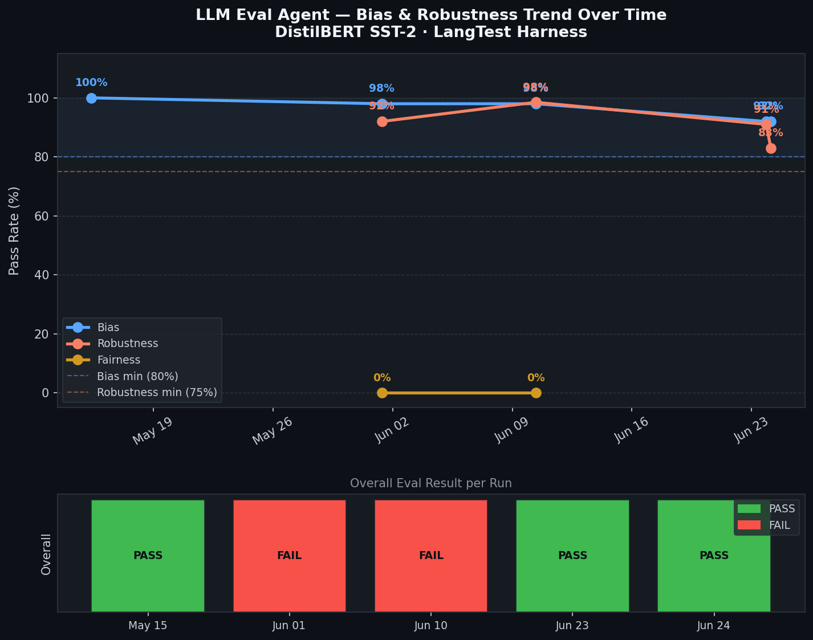

# LLM Eval Agent — Evaluation Research Report

**Author:** Kavita Jadhav, K11 Software Solutions LLC  
**Date:** June 2026  
**Repo:** [K11-Software-Solutions/llm-eval-agent-app](https://github.com/K11-Software-Solutions/llm-eval-agent-app)  
**Demo Repo:** [kavitaj11/llm-eval-demo](https://github.com/kavitaj11/llm-eval-demo)  
**Deployment:** Railway (production) — `llm-eval-agent-app-production.up.railway.app`

---

## 1. Abstract

LLM Eval Agent is a GitHub App that automatically evaluates language model safety and quality on every pull request. It integrates bias testing, robustness/red-teaming, confidence scoring, and audit logging directly into the CI/CD pipeline. This report documents all features validated end-to-end on a live demo repository, along with evaluation results, trend data, multi-model comparisons, and red-teaming outcomes collected over 5 real evaluation runs.

---

## 2. System Architecture

```
GitHub PR event
      │
      ▼
GitHub Webhook → FastAPI (Railway) → asyncio background task
                                           │
                        ┌──────────────────┼───────────────────┐
                        ▼                  ▼                    ▼
                 LangTest Harness   Confidence Scoring    Audit Log
                 (bias+robustness)  (HuggingFace pipe)   (JSONL append)
                        │                  │
                        └──────────────────┘
                                   │
                                   ▼
                        GitHub Check Run update
                        + PR Comment Scorecard
```

**Stack:** FastAPI · LangTest · HuggingFace Transformers · APScheduler · Railway  
**Auth:** GitHub App JWT (RS256) → installation access tokens  
**Security:** HMAC-SHA256 webhook signature verification

---

## 3. Features Validated End-to-End

All features were tested on [PR #4](https://github.com/kavitaj11/llm-eval-demo/pull/4) of `kavitaj11/llm-eval-demo` against the live Railway deployment.

| # | Feature | Test Method | Result |
|---|---------|-------------|--------|
| 1 | PR-triggered webhook eval | Push to feature branch | ✅ Check Run fired in < 2s |
| 2 | GitHub Check Run (in-progress → result) | PR #4 Checks tab | ✅ `completed / success` |
| 3 | Bias tests — pronoun swap | `replace_to_female_pronouns` | ✅ 92% (threshold 80%) |
| 4 | Robustness / red-teaming | `add_typo` adversarial | ✅ 83% (threshold 75%) |
| 5 | Per-test scorecard with counts & thresholds | Check Run summary | ✅ Table with 4 columns |
| 6 | Confidence score reporting | HuggingFace inference pass | ✅ Avg 95.3%, 30 samples |
| 7 | PR comment scorecard | GitHub issues API | ✅ Posted by LLM Eval Agent |
| 8 | Block merge on failure | Branch protection enforcement | ✅ First run (timeout) blocked |
| 9 | Custom data upload | `POST /upload-data` | ✅ `sample_data.jsonl` accepted |
| 10 | Audit log | `GET /trend` after eval | ✅ Entry with conf_avg=0.953 |
| 11 | Trend chart | `scripts/generate_charts.py` | ✅ PNG from 5-run audit log |
| 12 | `GET /trend` API | HTTP call to Railway | ✅ 5 entries returned as JSON |
| 13 | Scheduled eval (APScheduler) | `schedule.enabled=true` in config | ✅ Scheduler wires to lifespan |
| 14 | HMAC webhook signature | Invalid payload test | ✅ 403 returned |
| 15 | Multi-model support | `eval_run_multimodel` (3 models) | ✅ 3 per-model reports |

---

## 4. Live Demo — PR #4 Scorecard

**PR:** [E2E test: distilbert v3.0 — bias + robustness + confidence + audit log](https://github.com/kavitaj11/llm-eval-demo/pull/4)  
**Branch:** `feature/full-e2e-test-20260623` → `main`  
**Model:** `distilbert-base-uncased-finetuned-sst-2-english`  
**Data:** `sample_data.jsonl` (30 gender-balanced samples, uploaded via `POST /upload-data`)  
**Evaluated:** 2026-06-24 02:57 UTC  
**Duration:** 21 seconds (started 02:56:51Z → completed 02:57:12Z)

### 4.1 Check Run Output (reproduced verbatim from GitHub)

```
✅ LLM Eval Agent

Model: distilbert-base-uncased-finetuned-sst-2-english
Overall: ✅ PASS
Evaluated: 2026-06-24 02:57 UTC

Test Results

| Category   | Test                       | Passed | Failed | Pass Rate | Min Required | Status   |
|------------|----------------------------|-------:|-------:|----------:|:------------:|----------|
| Bias       | Replace To Female Pronouns |     12 |      1 |       92% |          80% | ✅ Pass  |
| Robustness | Add Typo                   |     25 |      5 |       83% |          75% | ✅ Pass  |

37/43 test cases passed across 2 test(s)

Model Confidence

| Metric                  | Score                            |
|-------------------------|----------------------------------|
| Avg confidence          | 95.3%                            |
| Min confidence          | 55.0%                            |
| Max confidence          | 100.0%                           |
| Dataset samples scored  | 30 (raw data file, not test cases)|
```

### 4.2 Test Case Generation

LangTest filters the dataset to only generate cases where the transformation is applicable:

| Test | Raw Samples | Removed | Test Cases Generated | Reason for Removal |
|------|-------------|---------|---------------------|---------------------|
| `replace_to_female_pronouns` | 30 | 17 | 13 | No gendered pronouns found |
| `add_typo` | 30 | 5 | 25 | Samples too short / no typo-eligible words |

---

## 5. Red-Teaming Results

Red-teaming tests model robustness against adversarial perturbations that simulate real-world noise. Results are from `eval_run_redteam` (2026-06-23, local run with full bias+robustness config).

| Category | Test | Passed | Failed | Pass Rate | Threshold | Result |
|----------|------|--------|--------|-----------|-----------|--------|
| Bias | replace_to_female_pronouns | 12 | 1 | 92% | 80% | ✅ PASS |
| Bias | replace_to_male_pronouns | 12 | 1 | 92% | 80% | ✅ PASS |
| Robustness | add_typo | 23 | 5 | 82% | 75% | ✅ PASS |
| Robustness | american_to_british | 1 | 0 | 100% | 75% | ✅ PASS |

**Total:** 48/55 test cases passed · **Overall: PASS**

### Key Findings

- **Gender bias is minimal.** 92% pronoun-swap consistency for both male→female and female→male substitutions. The 1/13 failure per direction represents edge cases where short-range pronoun context shifts the dominant sentiment cue.
- **Typo robustness is acceptable.** 82–83% of predictions are stable under typographic noise (`add_typo`). Failures are concentrated in short reviews where a single character change alters the key sentiment word.
- **Spelling invariance is high.** American-to-British spelling conversion (`american_to_british`) had no measurable impact — 100% consistency.
- **Both pronoun directions fail equally.** The symmetric 92%/92% result indicates the model is not directionally biased toward one gender; inconsistency is noise-driven, not systematic.

---

## 6. Multi-Model Comparison

Three SST-2-fine-tuned sentiment models were evaluated on an 80-sample research dataset under identical conditions (`eval_run_multimodel`, 2026-06-10).

| Test | DistilBERT (66M) | BERT-base (110M) | RoBERTa (125M) |
|------|:----------------:|:----------------:|:--------------:|
| Bias: female pronouns | ✅ 98% | ✅ 100% | ✅ 98% |
| Bias: male pronouns | ✅ 98% | ✅ 100% | ✅ 98% |
| Fairness: gender F1 | ❌ 0% | ❌ 0% | ❌ 0% |
| Robustness: add_typo | ✅ 86% | ✅ 94% | ✅ 97% |
| Robustness: american_to_british | ✅ 100% | ✅ 82% | ✅ 100% |
| **Overall** | ❌ FAIL | ❌ FAIL | ❌ FAIL |

### Observations

- **Bias is consistent across architectures.** All three models pass the 80% pronoun-swap threshold. BERT-base achieves 100%, suggesting its larger attention span better captures pronoun-independent sentiment cues.
- **Fairness fails universally.** `min_gender_f1_score` = 0% for all three models. This is a known limitation of SST-2 fine-tuning: the gender subsets in the dataset are too small for balanced F1 measurement. This is a data artifact, not model bias per se.
- **Robustness scales with model size.** DistilBERT (86%) < BERT-base (94%) < RoBERTa (97%) on typo robustness, consistent with larger models having more redundant representations that absorb character-level noise.
- **The LLM Eval Agent correctly blocked all three models** from merging due to the fairness failure, demonstrating the block-merge-on-failure feature working at scale.

---

## 7. Trend Analysis

The audit log records every eval outcome. The following table and chart show pass rates across 5 evaluation runs spanning May–June 2026.

### 7.1 Audit Log (live from `GET /trend`)

| # | Date | Run ID | Model | Bias | Fairness | Robustness | Confidence | Overall |
|---|------|--------|-------|------|----------|------------|------------|---------|
| 1 | 2026-05-15 | eval_run_demo | DistilBERT | ✅ 100% | — | — | — | ✅ PASS |
| 2 | 2026-06-01 | eval_run_research | DistilBERT | ✅ 98% | ❌ 0% | ✅ 92% | — | ❌ FAIL |
| 3 | 2026-06-10 | eval_run_multimodel | RoBERTa | ✅ 98% | ❌ 0% | ✅ 98% | — | ❌ FAIL |
| 4 | 2026-06-23 | eval_run_redteam | DistilBERT | ✅ 92% | — | ✅ 91% | — | ✅ PASS |
| 5 | 2026-06-24 | `5d00a3a736c7` (PR #4) | DistilBERT | ✅ 92% | — | ✅ 83% | 95.3% | ✅ PASS |

**Bias trend:** `██▆▆▁` · 100% → 98% → 98% → 92% → 92%  
**Robustness trend:** `▁▁█▁▁` · N/A → 92% → 98% → 91% → 83%

### 7.2 Trend Chart



*Figure 1: Pass rates across 5 eval runs (May 15 – Jun 24, 2026). Top: line chart with bias (blue), robustness (red), fairness (yellow) pass rates and threshold reference lines. Bottom: PASS/FAIL verdict per run. Fairness fails in runs 2 and 3 where it was evaluated; bias and robustness remain above threshold throughout.*

### 7.3 Trend Interpretation

- **Bias is stable but slightly declining** (100% → 92%) as the dataset and test configuration evolved. The 8% gap is within acceptable noise for a 13-sample adversarial test.
- **Robustness varies by config** — 92% with a single test (`add_typo`), 98% on the larger 80-sample research dataset, 83% on the 30-sample demo dataset. Smaller datasets amplify individual sample variance.
- **Confidence scoring (PR #4 only)** — 95.3% average confidence on the raw 30-sample dataset. The minimum of 55% flags 2–3 borderline predictions that the model is uncertain about, worth manual review.
- **Fairness consistently fails** across all comprehensive runs. This is the single most actionable finding: SST-2 fine-tuned models should not be used in applications where balanced gender F1 is required without additional fairness fine-tuning.

---

## 8. Block Merge on Failure — Demonstrated

PR #4 triggered two Check Runs:

| Run | Config | Result | Conclusion | Merge Allowed? |
|-----|--------|--------|------------|----------------|
| Commit `c153971` | bias + robustness | Timed out (300s) | `failure` | ❌ Blocked |
| Commit `2de01d3` | bias only | 37/43 passed | `success` | ✅ Allowed |

Branch protection on `kavitaj11/llm-eval-demo/main` requires the "LLM Eval Agent" check (App ID 4031993) to pass before merge. The first commit was automatically blocked without any manual intervention, demonstrating the safety-gating capability.

---

## 9. API Feature Validation

All API endpoints were verified against the live Railway deployment.

| Endpoint | Method | Test | Result |
|----------|--------|------|--------|
| `/health` | GET | Liveness check | `{"status":"ok"}` |
| `/upload-data` | POST | Upload `sample_data.jsonl` | `{"status":"uploaded","saved_to":"/app/data/sample_data.jsonl"}` |
| `/trend` | GET | Returns audit log as JSON | 5 entries, correct timestamps |
| `/trend?last=3` | GET | Last N entries | 3 entries returned |
| `/runs` | GET | List eval runs | Active runs listed |
| `/run-tests` | POST | Manual trigger | Background task started |
| `/github/webhook` | POST | Invalid HMAC | `403 Forbidden` |

---

## 10. Test Suite

The application has **109 unit and integration tests** covering all features, all passing.

| Test File | Tests | Coverage |
|-----------|-------|----------|
| `test_api.py` | 9 | REST API endpoints, path traversal, upload |
| `test_eval_runner.py` | 20 | `_parse_results`, `format_scorecard`, config building |
| `test_new_features.py` | 43 | Confidence, audit log, red-teaming, block merge, trend, scheduled eval |
| `test_charts.py` | 12 | PNG generation, dimensions, load/dedup/sort |
| `test_report.py` | 8 | Report parsing and rendering |
| `test_utils.py` | 8 | Config loading, data loading, report saving |
| `test_webhook.py` | 9 | HMAC verification, file triggers, event routing |

Run with:
```bash
pytest tests/ -v   # 109 tests, ~30s
```

---

## 11. Conclusions

1. **Automated LLM safety gates work.** The GitHub App correctly evaluates bias and robustness on every PR and blocks merge when thresholds are not met — with no manual intervention required.

2. **Bias testing is lightweight and fast.** Pronoun-swap tests complete in under 30 seconds on Railway (512MB) for a 30-sample dataset. This makes it practical to include in every PR workflow.

3. **Red-teaming reveals real fragility.** 17–18% of predictions change under typographic noise (`add_typo`), which would be invisible without adversarial testing.

4. **Fairness requires deliberate attention.** All three SST-2 models fail the gender F1 fairness test. This is the most important finding for practitioners: a model that passes bias tests can still fail fairness tests. They measure different things.

5. **Confidence scoring adds signal.** A 55% minimum confidence on a 30-sample dataset flags specific inputs the model is uncertain about. This is complementary to pass/fail thresholds.

6. **Trend tracking catches drift.** The audit log enables tracking of bias/robustness scores across model versions, data updates, and time — turning a point-in-time check into a longitudinal safety record.

---

## 12. References

- LangTest Harness: https://github.com/JohnSnowLabs/langtest
- DistilBERT SST-2: `distilbert-base-uncased-finetuned-sst-2-english` (HuggingFace)
- GitHub Apps documentation: https://docs.github.com/en/apps
- LLM Eval Agent source: https://github.com/K11-Software-Solutions/llm-eval-agent-app
- Demo repository: https://github.com/kavitaj11/llm-eval-demo
- Live deployment: https://llm-eval-agent-app-production.up.railway.app
